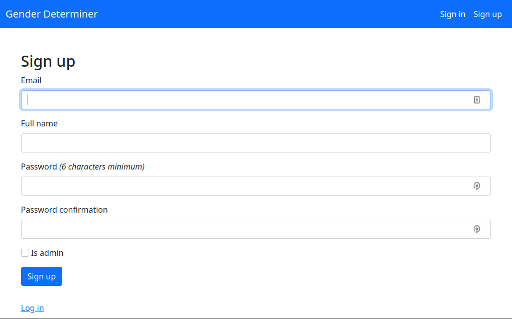
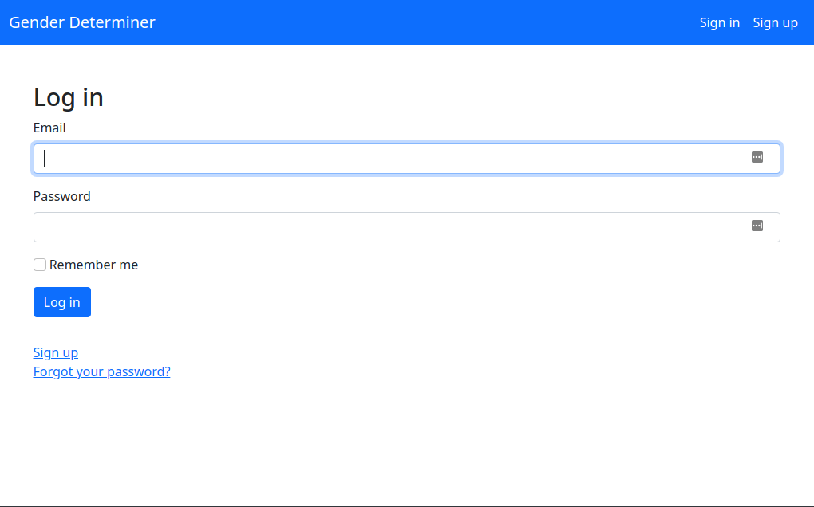
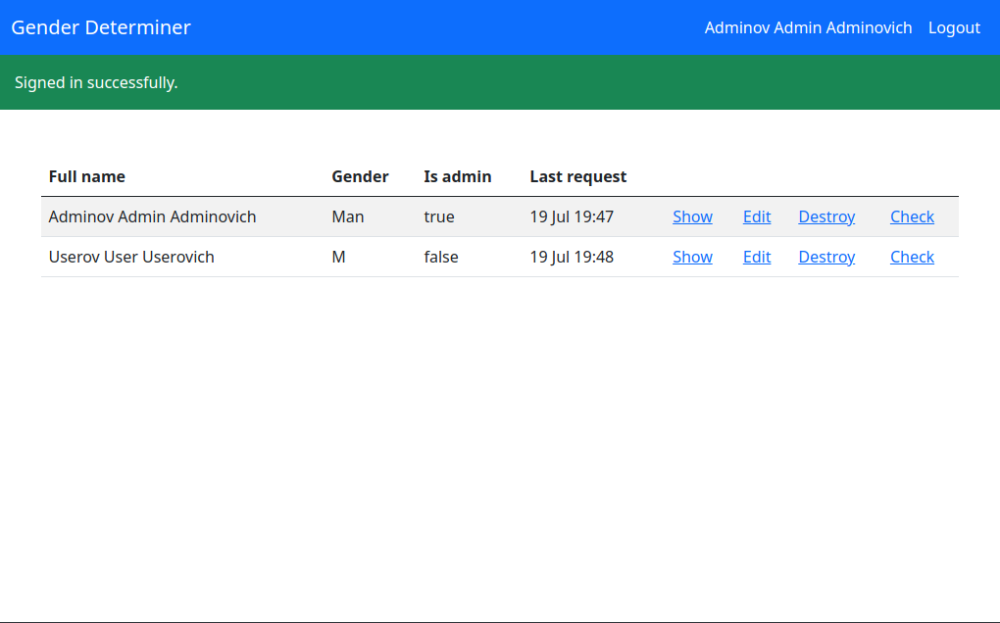
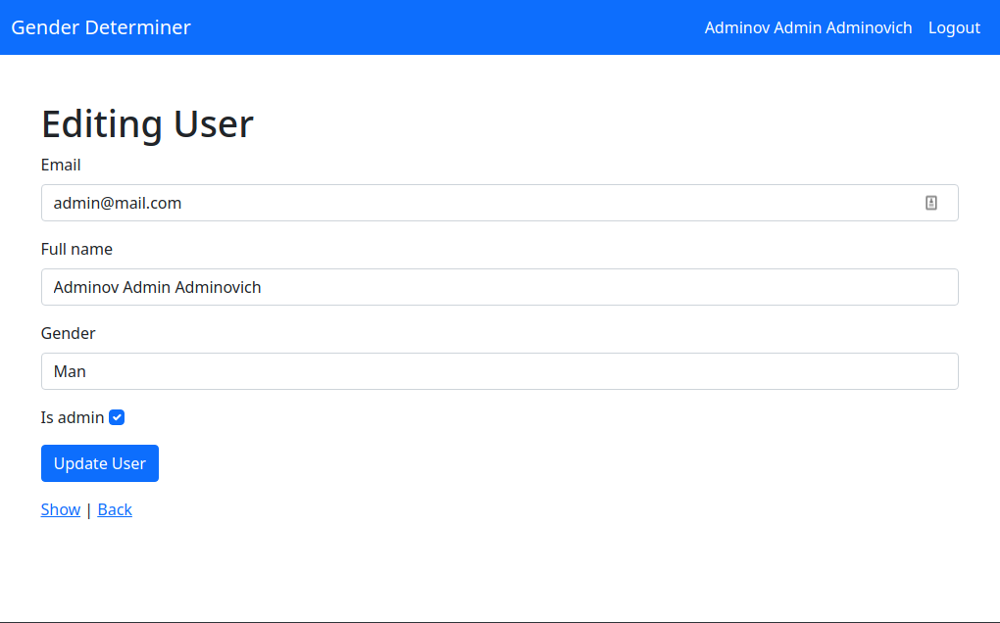

# Gender Determiner
## Ссылка на heroku -> [heroku](https://shielded-inlet-23394.herokuapp.com/)
## О проекте
Приложение определяет пол человека по ФИО

## Запуск
```
docker-compose run --rm web bash -c "bundle install"
docker-compose run --rm web bash -c "rails db:create db:migrate"
docker-compose up
```

## Функциональность
- Регистрация пользователя
- Авторизация
- Определение пола по ФИО

## Используемые технологии
- Ruby 2.7
- Ruby on Rails 6
- PostgreSQL
- Bootstrap CSS 5

### Изображения



